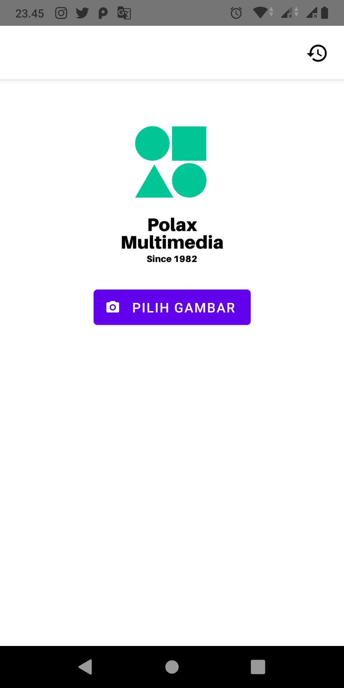
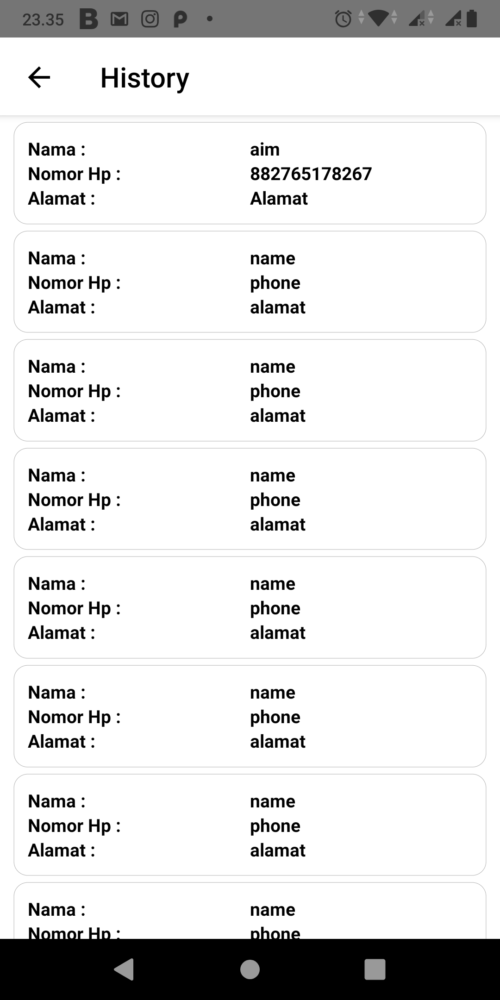
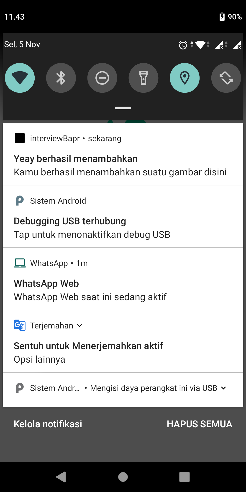
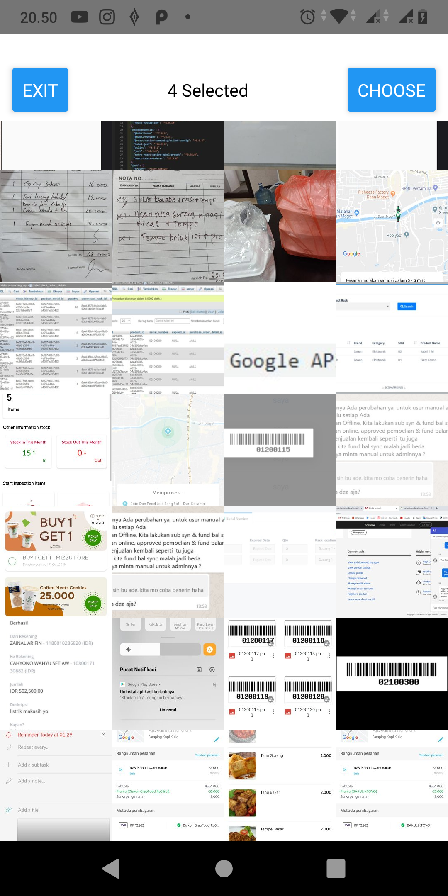
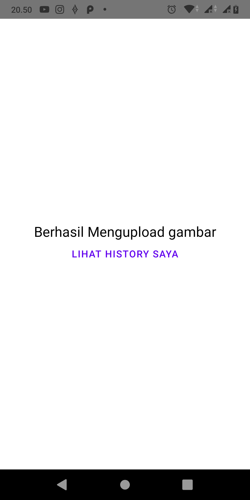
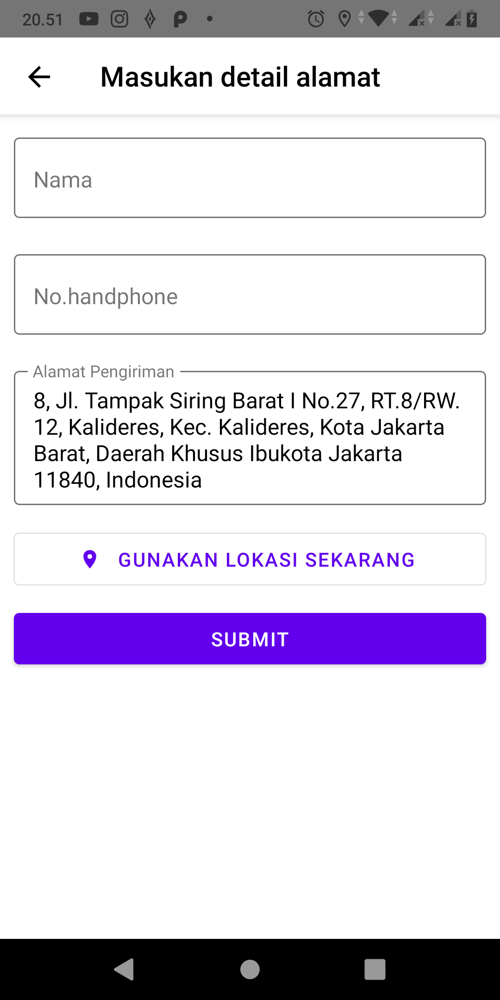

# INTRODUCING PHOTOBOOTH APPLICATION

## 1. Home Page
</img>

    Home Page pada halaman App merupakan halaman awal saat menggunakan App. 
    - Tekan tombol Pilih gambar untuk memilih gambar.
    - Tekan Tombol History icon untuk melihat history upload image

## 2. history Page
</img>

    History Page, yang berisi list dari history upload image
    - Disini kita hanya langsung mendapatkan list history saja

    ps : Apabila hanya loading yang muncul, Kemungkinan koneksi internet anda kurang baik, atau aplikasi sedang memanggil API

## 3. Notification 
</img>

    Notifikasi muncul ketika user sukses untuk mengupload gambar ke backend

## 4. Pilih Page
</img>

    Pilih page, yang berisi list gambar yang diambil menggunakan cameraRoll

## 5. Sukses Page
</img>

    Sukses Page, hanya page ketika user berhasil upload image

## 5. Form Page
</img>

    Form Page,Page yang digunakan user untuk input identitas

# How To Install The App ?

1. clone The repository
2. install all the package 
        
        $ yarn

4. clear gradle

        $ cd android && gradlew clean

5. run App on your android device

        $ react-native run-android

    - if there any problems like

            error Failed to install the app. Make sure you have an Android emulator running or a device connected.
        
    - make sure you have access to your android device or android emulator.

    - and check the list of devices

            $ adb devices
    
    - example response :

            $ adb devices

            List of devices attached
            adb server version (41) doesn't match this client (39); killing...
            * daemon started successfully
            emulator-5554   device

    - then go to step 5 to install the app on your devices

    - if there are many devices on list
    - example response : 

            $ adb devices

            List of devices attached
            adb server version (41) doesn't match this client (39); killing...
            * daemon started successfully
            emulator-5554   device
            emulator-5937   device
    
    - type this to install the App on selected devices

            $ react-native run-android emulator-5937

